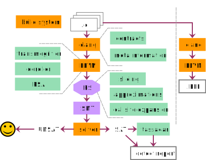

## Intro

We are a laboratory of static analysis and verification: it's in the name

- Aegis, abstract-ish interpretation [discontinued]
- Borealis bounded model checker [frozen]
- Smaller projects (assorted):
    - Abstract interpretation inside Borealis
    - Static analysis mode in Kex
    - Static analysis university courses
    - LLVM-analyzer using types and effects

## Bounded Model Checking (overly simplified)

#. Unroll and bound the program so it becomes finite
#. Turn finite program into a logical formula
#. Turn safety violation condition into a formula
#. Combine
#. Solve using SMT-solver
#. Rinse and repeat

## Borealis BMC

* Bounded Model Checking tool for C
* Written in C++
* Based on LLVM and Z3
* Stuck in the limbo between research prototyping and production
* Currently frozen

## 

\center



## Borealis: publications

\linespread{0.8}
\setsansfont[BoldFont={Fira Sans Bold}, Scale=0.8]{Fira Sans}

\begin{description}
\item[2017]{Borealis bounded model checker: the coming of age story}
\item[2019]{Making Bounded Model Checking Interprocedural in (Static Analysis) Style}
\item[2017]{Distributed Analysis of the BMC Kind: Making It Fit the Tornado Supercomputer}
\item[2016]{By the power of SMT! mining function contracts to better bounded model checking}
\item[2015]{Fast and safe concrete code execution for reinforcing static analysis and verification}
\item[2014]{Random model sampling: Making craig interpolation work when it should not}
\item[2014]{Using a Bounded Model Checker for Test Generation: How to Kill Two Birds with One SMT-solver}
\item[2014]{Improving Static Analysis by Loop Unrolling on an Arbitrary Iteration}
\item[2013]{Software Defect Detection Using Bounded Model Checking and Function Summaries}
\item[2013]{Yet Another Defect Detection: Combining Bounded Model Checking and Code Contracts}
\end{description}


## Borealis program model

- Predicate State
    - A middleground between the program and SMT
    - Kinda' language-independent
- Precise modeling of memory using array theory

## Major challenges for BMC

- External libraries
- System calls
- Multiprocedural analysis
- Loops
- Speed!

## Borealis contracts

- A comment-based language based on ACSL

```C
// @requires a > 0
void foo(int a) {...}
```

- Supports stateful contracts using custom properties
- The whole standard library is annotated!


## Loop backstabbing

- Loops are a problem for BMC: they are unrolled to a fixed number of iterations
- Loop backstabbing technique:
    - Try to extract a single *symbolic iteration*
    - Using symbolic algebra/numerical methods
- Can be turned into a formula *without unrolling*

## Loop backstabbing

Before:

```C
int j = 7;
while (j < N) {
    j += 2;
}
```

After:

```C
int ITERATION = 0;
int j;
while (j < N) {
    j = 7 + 2 * ITERATION;
}
``` 

## Memory spacing

- Handling memory using arrays produces huge arrays
- You can divide all the pointers into disjoint sets
    - Each sets "lives" in a separate memory
- This significantly improves SMT array performance

## Abstract interpretation frontend

- BMC is slow but precise
- Why not run some lightweight analysis beforehand and only run BMC after?

- A number of analyses based on abstract interpretation
    - Null pointer checker
    - Range analysis

## Tassadar semi-symbolic executor

- BMC is sometimes imprecise due to loops, functions and syscalls
- False positives for some defects can be filtered out by just running the code!

## Tassadar semi-symbolic executor

- "Just" running the code is not enough
    - May lead to different results
    - May crash for different reason
    - Impossible to map back to what BMC did
    - Need input!
- Tassadar: semi-symbolic execution
    - Custom-built LLVM IR interpreter
    - Safe memory implementation using custom data structures
    - Can treat some values "symbolically" and reconstruct them from SMT model

## A word about solvers

- We started with using "plain" Z3
- It is not enough

- On some marginal inputs Z3 may "think" for tens of minutes for one call
- It is entirely unpredictable

## A word about solvers

- On some marginal inputs Z3 may thing for tens of minutes for one call
- Different solvers: CVC4, STP, Boolector, etc.
- Timeouts in seconds: better skip marginal cases than stop for minutes

## What solver we stopped on?

- All of them!

- Portfolio solver:
    - Runs the problem on all the solvers in parallel
    - Whoever finishes first, wins
    - Result: next to no timeouts
    - Some overhead on communication

## Speed: bloody details

- A lot of other small tricks were employed:
    - Tricky formula transformations
    - Special slicing
    - Custom memory allocators
    - Custom logging facilities
    - Lots of caching
    - etc.

## 

With all the improvements above, we travelled from analysing `git` from *2 weeks* real time to *19 minutes* real time with the same results

## Current project status

Borealis is frozen: 

- It is not actively developed
- It seems pretty hard to update it to current dependencies

Kex is the new Borealis:

- It uses the (nearly) same program model
- Symbolic engines are interchangeable
- Implementing defect detection techniques on top of Kex seems easier than reviving Borealis

## Details

See our final paper for details:

Akhin, Marat & Belyaev, Mikhail & Itsykson, Vladimir. (2017). Borealis Bounded Model Checker: The Coming of Age Story.\newline
Present and Ulterior Software Engineering (PAUSE)

## Contacts

<belyaev@kspt.icc.spbstu.ru>

<https://github.com/vorpal-research/borealis>
