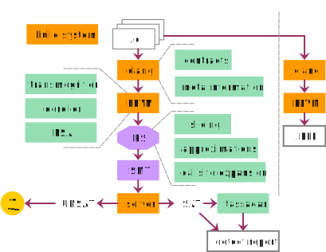

## Intro

We are a laboratory of static analysis and verification: it's in the name

- Aegis, abstract-ish interpretation [discontinued]
- Borealis bounded model checker [frozen]
- Smaller projects (assorted):
    - Abstract interpretation inside Borealis
    - Static analysis mode in Kex
    - Static analysis university courses
    - LLVM-analyzer using types and effects

## Bounded Model Checking (overly simplified)

#. Unroll and bound the program so it becomes finite
#. Turn finite program into a logical formula
#. Turn safety violation condition into a formula
#. Combine
#. Solve using SMT-solver
#. Rinse and repeat

## Borealis BMC

* Bounded Model Checking tool for C
* Written in C++
* Based on LLVM and Z3
* Stuck in the limbo between research prototyping and production
* Currently frozen

## 

\center

## Borealis: publications

\tiny
\begin{description}
\item[2017]{Borealis bounded model checker: the coming of age story}
\item[2019]{Making Bounded Model Checking Interprocedural in (Static Analysis) Style}
\item[2017]{Distributed Analysis of the BMC Kind: Making It Fit the Tornado Supercomputer}
\item[2016]{By the power of SMT! mining function contracts to better bounded model checking}
\item[2015]{Fast and safe concrete code execution for reinforcing static analysis and verification}
\item[2014]{Random model sampling: Making craig interpolation work when it should not}
\item[2014]{Using a Bounded Model Checker for Test Generation: How to Kill Two Birds with One SMT-solver}
\item[2014]{Improving Static Analysis by Loop Unrolling on an Arbitrary Iteration}
\item[2014]{Software Defect Detection by Combining Bounded Model Checking and Approximations Of Functions}
\item[2014]{Using a Bounded Model Checker for Test Generation: How to Kill Two Birds with One SMT-solver}
\item[2013]{Software Defect Detection Using Bounded Model Checking and Function Summaries}
\item[2013]{ Yet Another Defect Detection: Combining Bounded Model Checking and Code Contracts}
\end{description}

## Borealis program model

- Predicate State
    - A middleground between the program and SMT
    - Kinda' language-independent
- Precise modeling of memory using array theory

